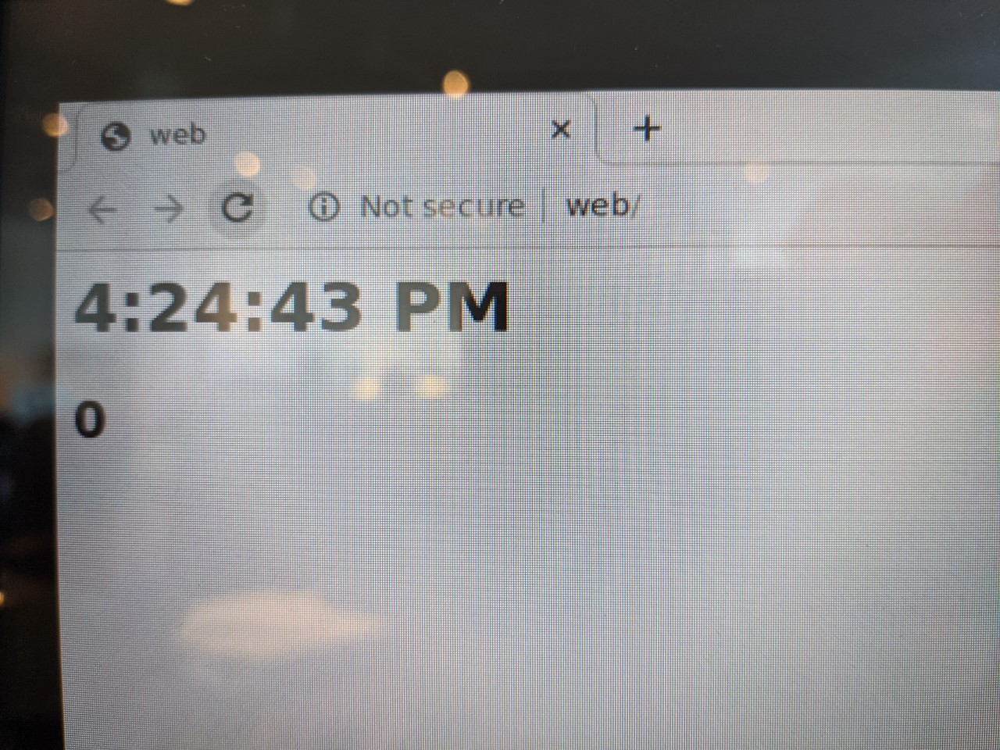

# balena-browser-timezone-bug
## Mini-repo to demonstrate TZ issue with Javascript in balenablocks/browser

### Usage
1. Clone this repository
2. `balena app create myapp`
3. `balena push myapp`
4. `balena env add RESIN_HOST_CONFIG_gpu_mem 128 -a myapp`
5. `balena env add TZ America/New_York -a myapp`
6. Move a device to `myapp`
7. Get device time: `echo date | balena ssh <device>`
8. Get browser time: `echo date | balena ssh <device> browser`

### Results:
```
$ echo "date" | balena ssh <device>
Thu Mar  4 16:23:30 UTC 2021
$ echo "date" | balena ssh <device> browser
Thu Mar  4 11:23:57 EST 2021
```
Javascript gets UTC time instead of EST:
